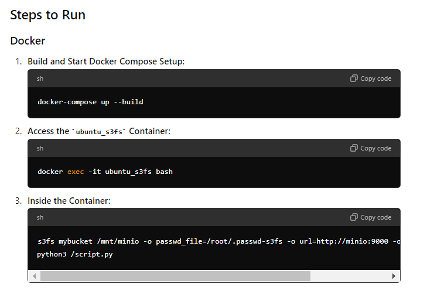

Steps to Run Docker

## Build and Start Docker Compose Setup:
docker-compose up --build

## Access the ubuntu_s3fs Container:
docker exec -it ubuntu_s3fs bash


## Inside the Container:
```
    s3fs mybucket /mnt/minio -o passwd_file=/root/.passwd-s3fs -o url=http://minio:9000 -o use_path_request_style
    python3 /script.py
```