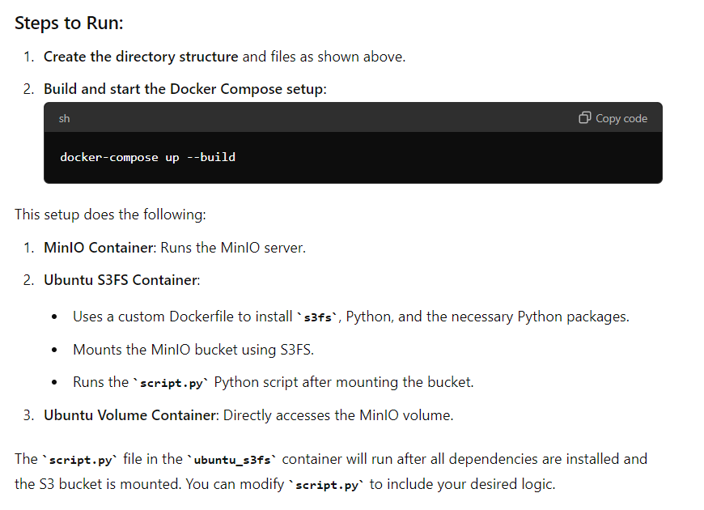
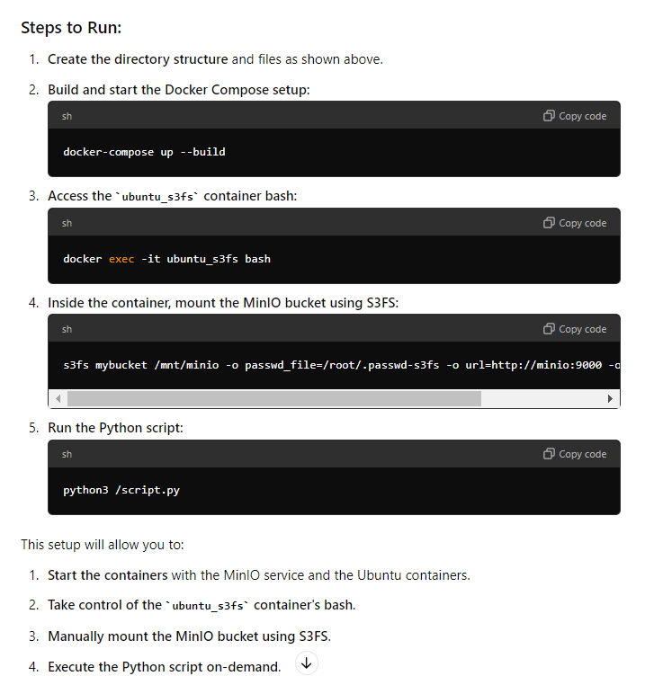

## Directory Structure

```
.
├── docker-compose.yml
├── ubuntu_s3fs
│   ├── Dockerfile
│   ├── requirements.txt
│   └── script.py
└── passwd-s3fs
```

## docker-compose.yaml



## docker-compose_v2.yaml

