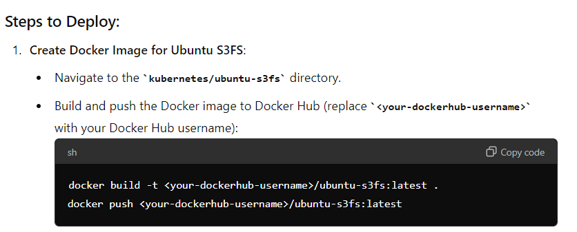
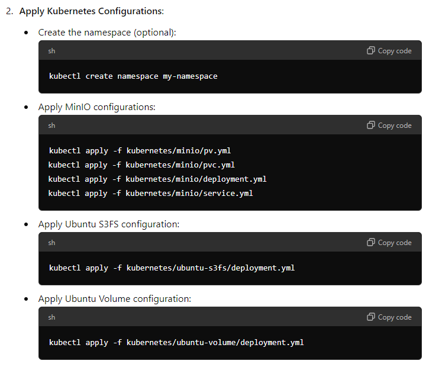
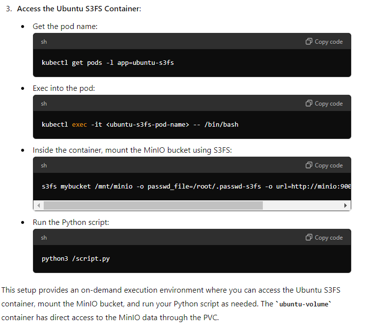
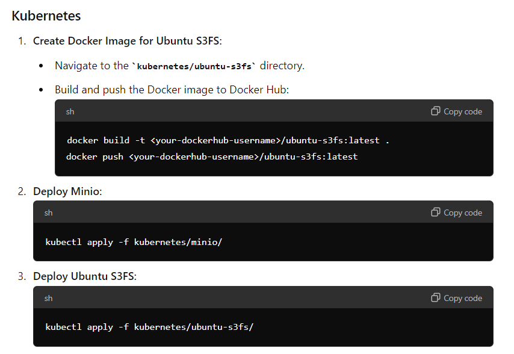
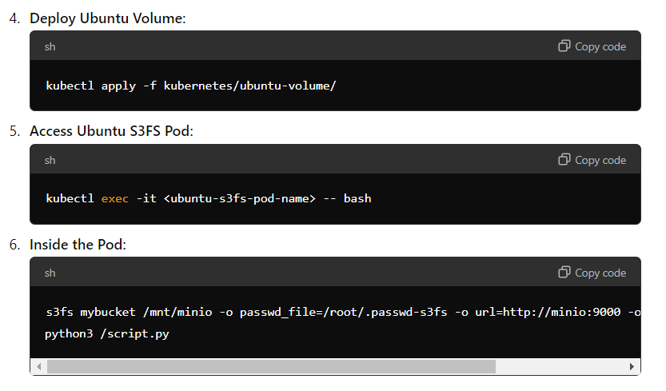

# Kubernetes



## Create Docker Image for Ubuntu S3FS:

1. Navigate to the kubernetes/ubuntu-s3fs directory.
2. Build and push the Docker image to Docker Hub:

docker build -t <your-dockerhub-username>/ubuntu-s3fs:latest .
docker push <your-dockerhub-username>/ubuntu-s3fs:latest

## Deploy Minio:
kubectl apply -f kubernetes/minio/

## Deploy Ubuntu S3FS:
kubectl apply -f kubernetes/ubuntu-s3fs/



## Deploy Ubuntu Volume:
kubectl apply -f kubernetes/ubuntu-volume/

## Access Ubuntu S3FS Pod:
kubectl exec -it <ubuntu-s3fs-pod-name> -- bash

## Inside the Pod:
```
    s3fs mybucket /mnt/minio -o passwd_file=/root/.passwd-s3fs -o url=http://minio:9000 -o use_path_request_style
    python3 /script.py
```

Feel free to customize the file paths and Docker image names as needed.